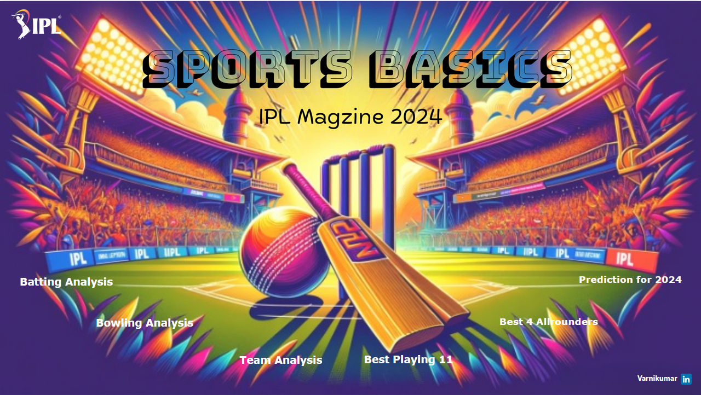

# 🏏 Sports Basics - IPL Analysis Project




## 📌 Overview
This project focuses on analyzing **Indian Premier League (IPL)** cricket data to derive insights about teams, players, and match statistics. The analysis includes data cleaning, exploratory data analysis (EDA), and visualization to uncover patterns and trends in IPL history.

---

## 📂 Project Structure
```
IPL/
│
├── Dataset/
├── Sports Basics - IPL Analysis.pbix      
├── meta_data.txt     
└── README.md            
```

---

## ✨ Features
- ✅ Data Cleaning & Preprocessing  
- ✅ Exploratory Data Analysis (EDA)  
- ✅ Player and Team Performance Analysis  
- ✅ Interactive & Static Visualizations  
- ✅ Insights into Most Valuable Players, Win Ratios, and Trends  

---

## 📊 Technologies Used
- **Python 3.x**
- **Pandas** (Data manipulation)
- **NumPy** (Numerical computations)
- **Matplotlib & Seaborn** (Data visualization)
- **Jupyter Notebook** (Analysis and visualization)
- **Power BI** (Attractive Dashboard)

---

## 📈 Sample Visualizations
Here are some sample insights you can generate:
- **Top 10 batsmen based on past 3 years total runs scored.**  
- **Top 10 bowlers based on past 3 years total wickets taken.**  
- **Top 5 batsmen based on past 3 years boundary (fours and sixes).**
- **Top 5 bowlers based on past 3 years dot ball**  
- **Top 4 teams based on past 3 years winning**


---


## 🤝 Contributing
Contributions, issues, and feature requests are welcome!  
Feel free to fork the repository and submit pull requests.

---

## 📝 License
This project is licensed under the **MIT License** – see the [LICENSE](LICENSE) file for details.
